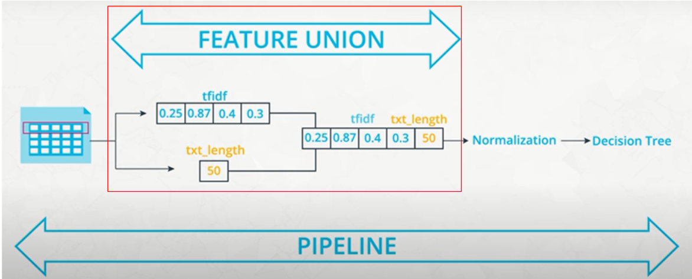

# Machine Learning Pipeline
Build pipeline to automate the machine learning workflow that train on the transformed data (after ETL).
Below is the project contents:
+ [Scikit-learn Pipeline](#Scikit-learn-Pipeline)
+ [Advantages of Machine Learning Pipelines](#Advantages-of-Using-Pipeline)
+ [Scikit-learn Feature Union](#Scikit-learn-Feature-Union)
+ [Pipelines and Grid Search]()
+ [Case Study]()

## Scikit-learn Pipeline
Here, we'll find a simple example of a machine learning workflow where we generate features from text data using 
count vectorizer and tf-idf transformer, and then fit it to a random forest classifier. 

Before we get into using pipelines, let's first use this example to go over some `scikit-learn` terminology.

+ **ESTIMATOR**: An [estimator](https://scikit-learn.org/stable/tutorial/statistical_inference/settings.html#estimators-objects) 
is any object that learns from data, whether it's a classification, regression, or 
clustering algorithm, or a transformer that extracts or filters useful features from raw data. Since estimators ***learn 
from data***, they each must have a `fit` method that takes a dataset. In the example below, the `CountVectorizer`, 
`TfidfTransformer`, and `RandomForestClassifier` are all estimators, and each have a `fit` method.
+ **TRANSFORMER**: A [transformer](https://scikit-learn.org/stable/data_transforms.html) is a specific type of estimator 
that has a `fit` method to learn from training data, 
and then a `transform` method to apply a transformation model to new data. These transformations can include cleaning, 
reducing, expanding, or generating features. In the example below, `CountVectorizer` and `TfidfTransformer` are 
transformers.
+ **PREDICTOR**: A **predictor** is a specific type of estimator that has a `predict` method to predict on test data based on 
a supervised learning algorithm, and has a `fit` method to train the model on training data. The final estimator, 
`RandomForestClassifier`, in the example below is a predictor.

In machine learning tasks, it's pretty common to have a very specific sequence of transformers to fit to data before 
applying a final estimator, such as this classifier. And normally, we'd have to initialize all the estimators, `fit` and 
`transform` the training data for each of the transformers, and then `fit` to the final estimator. Next, we'd have to 
call `transform` for each transformer again to the test data, and finally call `predict` on the final estimator.

### WITHOUT pipeline:

    vect = CountVectorizer()
    tfidf = TfidfTransformer()
    clf = RandomForestClassifier()

    # train classifier
    X_train_counts = vect.fit_transform(X_train)
    X_train_tfidf = tfidf.fit_transform(X_train_counts)
    clf.fit(X_train_tfidf, y_train)

    # predict on test data
    X_test_counts = vect.transform(X_test)
    X_test_tfidf = tfidf.transform(X_test_counts)
    y_pred = clf.predict(X_test_tfidf)

Fortunately, we can actually automate all of this fitting, transforming, and predicting, by chaining these estimators 
together into a single estimator object. That single estimator would be scikit-learn's Pipeline. To create this pipeline, 
we just need a list of `(key, value)` pairs, where the key is a string containing what we want to name the step, 
and the value is the estimator object.

### USE pipeline:

    pipeline = Pipeline([
        ('vect', CountVectorizer()),
        ('tfidf', TfidfTransformer()),
        ('clf', RandomForestClassifier()),
    ])
    
    # train classifier
    pipeline.fit(Xtrain)
    
    # evaluate all steps on test set
    predicted = pipeline.predict(Xtest)

Now, by fitting our pipeline to the training data, we're accomplishing exactly what we would by fitting and transforming 
each of these steps to our training data one by one. Similarly, when we call `predict` on our pipeline to our test data, 
we're accomplishing what we would by calling `transform` on each of our transformer objects to our test data and then 
calling `predict` on our final estimator. Not only does this make our code much shorter and simpler, it has other great 
advantages.

Note that every step of this pipeline has to be a transformer, except for the last step, which can be of an estimator 
type. Pipeline takes on all the methods of whatever the last estimator in its sequence is. 
For example, here, since the final estimator of our pipeline is a classifier, the pipeline object can be used as a 
classifier, taking on the `fit` and `predict` methods of its last step. 
Alternatively, if the last estimator was a transformer, then pipeline would be a transformer.

## Advantages of Using Pipeline
1. **Simplicity and Convencience**
   + **Automates repetitive steps** - Chaining all of your steps into one estimator allows you to fit and predict on all steps of your sequence automatically with one call. It handles smaller steps for you, so you can focus on implementing higher level changes swiftly and efficiently.
   + **Easily understandable workflow** - Not only does this make your code more concise, it also makes your workflow much easier to understand and modify. Without Pipeline, your model can easily turn into messy spaghetti code from all the adjustments and experimentation required to improve your model.
   + **Reduces mental workload** - Because Pipeline automates the intermediate actions required to execute each step, it reduces the mental burden of having to keep track of all your data transformations. Using Pipeline may require some extra work at the beginning of your modeling process, but it prevents a lot of headaches later on.

2. **Optimizing Entire Workflow** 
   + **GRID SEARCH**: Method that automates the process of testing different hyper parameters to optimize a model.
   + By running grid search on your pipeline, you're able to optimize your entire workflow, including data transformation and modeling steps. This accounts for any interactions among the steps that may affect the final metrics.
   + Without grid search, tuning these parameters can be painfully slow, incomplete, and messy.

3. **Preventing Data leakage**
   + Using Pipeline, all transformations for data preparation and feature extractions occur within each fold of the 
   cross validation process.
   + This prevents common mistakes where you’d allow your training process to be influenced by your test data - 
   for example, if you used the entire training dataset to normalize or extract features from your data.

## Scikit-learn Feature Union
### Pipelines and Feature Unions
**FEATURE UNION**: Feature union is a class in scikit-learn’s Pipeline module that allows us to perform steps in 
parallel and take the union of their results for the next step.

A **pipeline** performs a list of steps in a linear sequence, while a feature union performs a list of steps in 
parallel and then combines their results.

For instance, so far, we used pipeline to change transformations, and an estimator together to define a clear 
sequence for our workflow. But what if we want to engineer a feature from a dataset while simultaneously engineering 
another feature? 

For example, if we wanted to extract both TF-IDF and the number of characters text length for each document, in this 
case we would use ***feature unions***. Feature union is another class in scikit-learn’s Pipeline module that allows us to perform steps in 
parallel and take the union of their results for the next step. In other words, add the resulting features from both 
steps to the data before moving on to the next step. 

If we imaging pipeline to be a linear sequence of data transformations, a feature union would add 2 sequences of 
tranformations in parallel, like demostrated below:

Both TF-IDF and text_length are run after the load step, and the results are combined with the original set of features 
to be used in the next step. 

In more complex workflows, multiple feature unions are often used within pipelines, and multiple pipelines are used 
within feature unions.

### Using Feature Unions
Sometimes, we don't always have all the data transformation steps we need in scikit-learn's library, which is 
why it is possible to actually create our own custom transformers. For example used below, just keep in mind that 
`TextLengthExtractor` is a custom transformer that is already built in a separate file and imported for this example.

