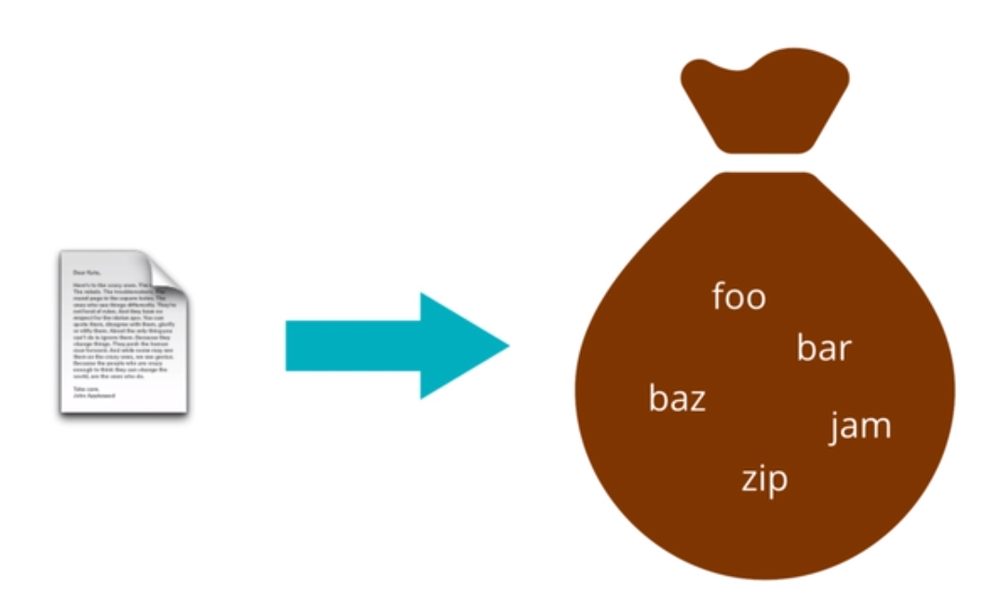
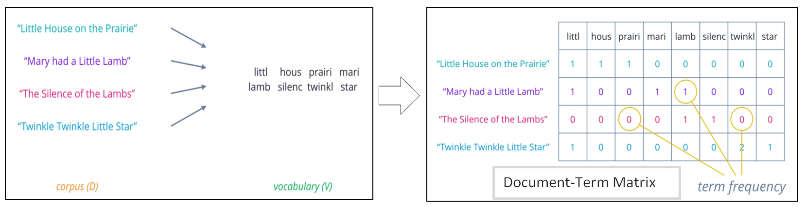
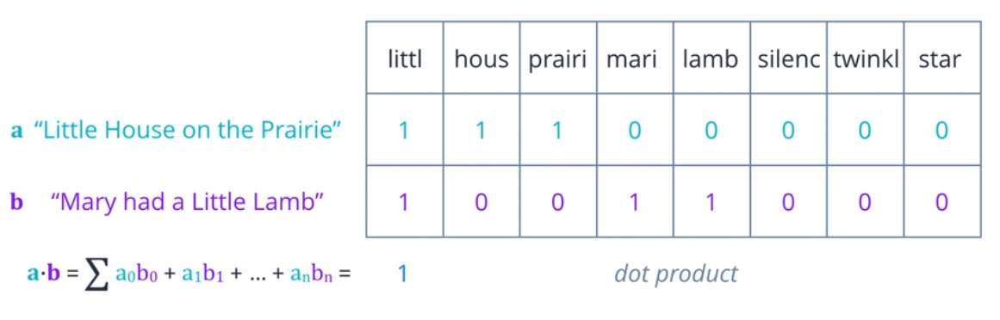
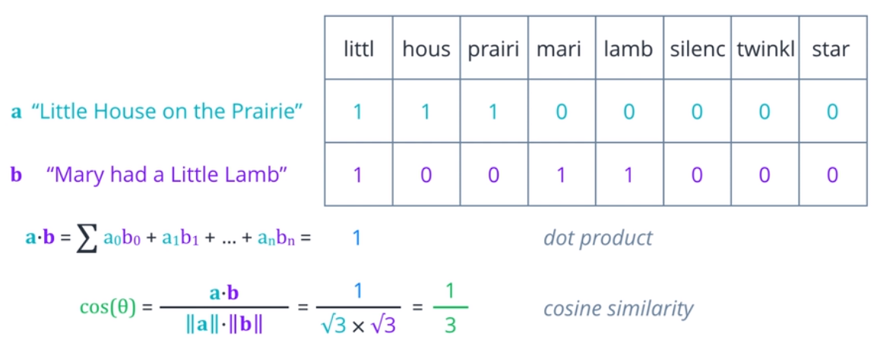
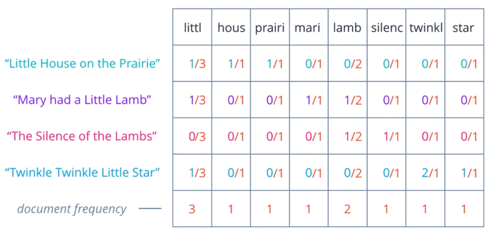
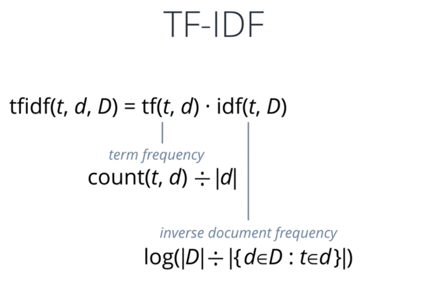
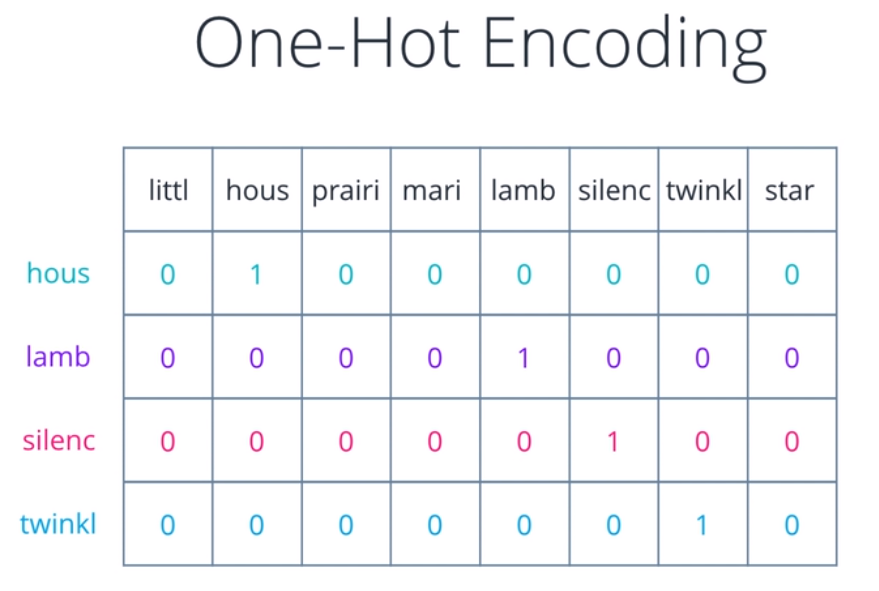

# Feature Extraction
## Why do we need Feature Extraction for text?
Text data is represented on modern computers using an encodings such as ASCII or Unicode that maps every character to 
a number. For example letter A is maps to 65, B is maps to 66, and C is maps to 67. Computers store and transmit these 
values as binary: zeros and ones. These numbers also have an implicit ordering, like 65 < 66 < 67. This implies A is 
less than B and less than C, which is not correct implication and might mislead our natural language processing 
algorithms. 

Moreover, individual characters do not carry much meaning at all, it is words like apple, bed or car that we should be 
concerned with. But computers do not have a standard representation for words. 

Therefore, we need to transform text into a form of representation that we can use as features for modeling, which is 
the reason for this step, **feature extraction**. 

## What feature extractions do we need?
There are many ways of representing textual information. Which ways to choose depends on what kind of model we are 
using and what task we are trying to accomplish:  

+ If we want to use a graph based model to extract insights, we can represent the words as symbolic nodes with 
relationships between them like WordNet. For statistical models however, we need some sort of numerical representation. 

+ Even then, we also have to think about the end goal. If we are performing a document level task, such as spam detection
or sentiment analysis, we can use a per document representations such as Bag-of-Words or Doc2Vec. If we are working with 
individual words and phrases such as for text generation or machine translation, we will need a word level representation 
such as Word2Vec or Glove. 

## Feature Extraction Techniques
   + [Bag of Words](#Bag-Of-Words)
   + [TF-IDF](#TF-IDF)
   + [One-Hot Encoding](#One-Hot-Encoding)
   + [Word Embeddings](#Word Embeddings)
   
### Bag-Of-Words

The Bag-Of-Words (BOW) model treats each document as an un-ordered collection or bag of words. Here, a document is the
unit of text that you want to analyze. For instance, if we want to compare essay submitted by students to check for 
plagiarism, each essay would be a document. If we want to convey the sentiment from a social tweets, then each tweet 
would be a document. 

To obtain a BOW from a piece of raw text, we need to simply apply appropriate text processing steps: cleaning, 
normalizing, splitting into words, stemming, lemmatization, etc. And then treat the resulting tokens as an un-ordered 
collection or set. So each document in your dataset will produce a set of words. But keeping these as separate sets is 
very inefficient. 

One more useful approach is to turn each document into a vector of numbers, representing how many times each word occurs
in a document. A set of documents is known as a corpus and this gives the context for the vectors to be calculated:
1. First, collect all the unique words present in the corpus to form a vocabulary. 
2. Arrange these words in some order and let them form a vector element positions or columns of a table, and assume 
each document is a row. 
3. Count the number of occurrences of each word in each document and enter the value in the respective column. At this 
stage, it is easy to think of this as Document-Term Matrix, illustrating the relationship between documents in rows, and
words or terms in columns. Each element can be interpreted as a term frequency. How frequently does that term occur in
this document? 

Consider what we can do with this representation. One possibility is to compare two documents based on how many words 
they have in common or how similar their term frequencies are. A more mathematical way to expressing that is to compute 
the dot product between the two row vectors, which is the sum of the products of corresponding elements. The greater 
the dot product, the more similar the two vectors are. 

The dot product has one flaw. It only captures the portions of overlap. It is not affected by other values that are not 
uncommon. So, pairs that are very different can end up with the same product as ones that are identical. A better 
measure is cosine similarity, where we divide the dot product of two vector by the product of their magnitudes or 
Euclidean norms. If we think of these vectors as arrows in some n-dimensional space, then this is equal to the cosine 
of the angle theta between them. Identical vectors have cosine equal one. Orthogonal vectors have cosine equal zero. 
And for vectors that are exactly opposite, it is minus one. So the value always range nicely between 1 for most similar, 
and -1 for most dissimilar.

### TF-IDF
One limitation of BOW approach is that it treats every word as being equally important. Whereas intuitively, we know
that some words occurs frequently within a corpus. For example, when looking at financial documents, costs or price 
maybe a pretty common term. We can compensate for this by counting the number of documents in which each word occurs.
This is call `document frequency`, and then dividing the term frequencies by the document frequency of that term. 

This gives us a metric that is proportional to the frequency of occurrence of a term in a document, but inversely 
proportional to the number of documents it appears in. It highlights the words that are more unique to a document,
and thus better for characterizing it. 

In mathematical form, TF-IDF is simply the product of two weights: a `term frequency` and an `inverse document frequency`.
The most commonly used form of TF-IDF defines: 
+ **Term Frequency** as the raw count of a term T in a document D, divided by total of terms in D
+ **Inverse document frequency** as the logarithm of, the total number of documents in the collection D, divided by the 
number of documents where T is present. 

Several variations exist, that try to normalize or smooth the resulting values or prevent edge cases such as divide 
by zero errors. 

Overall, TF-IDF is an innovative approach to assigning weights to words, that signify their relevance in documents. 

### BOW + TF-IDF
What can we accomplish with BOW and TF-IDF representation?

We can apply these representations to document classification tasks like Spam Detection. Here we use TF-IDF vectors 
as features, along with the label spam, not spam to set up a supervised learning problem. 

### One-Hot Encoding
So far, we've looked at representations that tried to characterize an entire document or collection of words as one unit.
As the result, the kinds of inferences we can make are also typically at a document level, mixture of topics in the 
document, documents similarity, documents sentiment, etc. For a deeper analysis of text, we need to come up with a 
numerical representation for each word. One-Hot Encoding is a useful approach to this. 

One-Hot Encoding treats each word like a class, assign it a vector that has one in a single pre-determined position for 
that word and zero everywhere else. 

It is just like the BOW idea, only that we keep a single word in each bag and build a vector for it. 

### Word Embeddings
One-hot encoding usually works in some situations, but break down when we have a large vocabulary to deal with, because 
the size of our ward representation grows with the number of words. What we need as a way to control the size of our 
word representation by limiting it to a fixed-size vector. 

